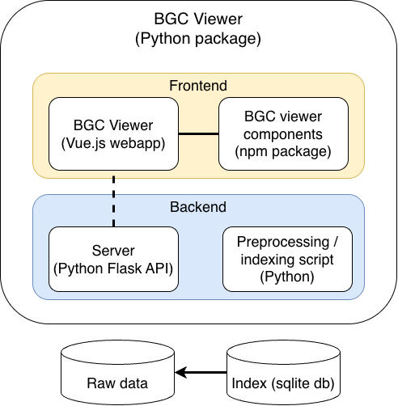

# Getting Started

Welcome to BGC Viewer! This guide will help you get started with visualizing biosynthetic gene clusters.

## What is BGC Viewer?

BGC Viewer is an interactive visualization tool for exploring Biosynthetic Gene Clusters (BGCs) from antiSMASH output files and other formats that contain feature and annotation data, such as GenBank files. It provides:

- Interactive track viewer - Zoom, pan, and explore gene clusters
- Multiple feature visualizations - Visualize regions, genes, domains, resistance markers, regulatory elements, and more from your genomic data
- Web components - Easy integration into your own applications

## Deployment use cases

The BGC Viewer can be used in a number of different use cases, including the following:

* As a standalone local application, for end users that want to keep data on the same machine.
* As an application on a local server, for (intranet) users to access in the browser or through an ssh tunnel.
* On a web server serving data publicly.
* By integrating the web components that make up the BGC Viewer in your own application.

## Project Structure

The project roughly consists of the backend and frontend.

- **backend**: Python Flask server that serves the API and statically built frontend.
- **frontend**: The frontend folder contains the code for both the web components (npm package) and the viewer as a stand-alone web application (separate build target).

The backend has two functions:
- An API that preprocesses, searches and serves data from a root directory containing huge amounts of data. The backend serves from the local file system in local mode, or from a fixed data directory in public mode [see configuration](#configuration) TODO: fix link.
- It serves the statically built frontend (html + javascript); the Python package contains everything to run the viewer as a stand-alone application.

The frontend has two functions, which are reflected in two separate build targets.
- The BGC Viewer is a stand-alone web application that can either use the backend API or other data sources. It is packaged with the backend for convenience for end-users, but could perfectly be run in a separate process.
- The frontend components can be used separately in other applications. They are published as an npm package.

## Next Steps

- [Installation Guide](./installation.md) - Set up BGC Viewer
- [Quick Start](./quick-start.md) - Run your first visualization
- [Component Reference](../components/track-viewer.md) - Explore available components
